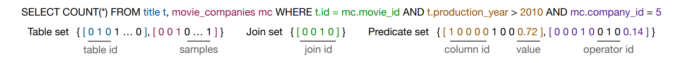

# RegCard
Learned Cardinalities Estimation with Regularities

*Yuanbiao Wang, Ziye Tao, Vic Feng*

## How to use

1. Groundtruth and Featurize

    First we generate bitmaps for the train data, and cardinalities + bitmaps for our created test datasets for evaluate the monotonicity.

    ```bash
    python3 reg/data_gen.py -d data -f train -b
    python3 reg/data_gen.py -d workloads -f <workload-name>
    ```

    The name of the workload can be `job-cmp-mini` or `job-cmp-light` for now, which are two synthetic query datasets we generated.

    This will also create the sampled materialized table view for each of the tables.

2. Training and Evaluation

    Then we run the training with the bitmaps. 

    ```bash
    python3 train.py <workload-name>-card --cmp <--cuda>
    ```
    
    Generate new queris and corresponding cmp file.
    ```bash
    python3 reg/test_gen.py -f <workload-name> -o <output file name>
    ```

    We added extra evaluation for the **monotonicity** by introducing the relative partial order labels in `job-cmp-mini-card.pairs`. We will utilize it to calculate the obeying rate.


## Problem Statement
Cardinality estimation plays an important role in database query optimization. Several recent papers show that learned cardinality estimation methods can achieve higher accuracy than traditional methods. However, one main obstacle preventing learned methods from production deployment is violating logical principles. For example, when we changed the query predicates from $[0, 100]$ to a smaller range $[0, 50]$, the real cardinality decreased, but the estimated cardinality by learned methods can be increased, which violates the monotonicity.

The main target of our project is to inspect the performance learned cardinality estimation with popular machine learning methods, and in the meanwhile try to evaluate how they conform to many heuristic regularities.

For the first half of our project, we mainly focus on implementing a cardinality estimation algorithm with convolutional networks, as well as designing appropriate benchmark to evaluate the monotonicity regularity.

## Designs

### Modeling and featurization

We used the open source code from [Thomas Kipf, et al.](https://github.com/andreaskipf/learnedcardinalities). In the paper, the author proposed multi-set convolutional network(MSCN) for cardinality estimation. The input features for this model are all one-hot encoded, including:

- tables selected from
- join predicates (which is encoded through the tables joined and the join condition)
- selection predicates (which is encoded through the join column and the threshold value)
- a bitmap on a materialized view of the tables selected using the corresponding single-table selection predicates (not the join ones!) with a sample size of 1000



We used their featurization as well as modeling code, but they didn't release the code for bitmap generation, so we have to implement this on our own. Since we are generating a much larger benchmarking dataset for monotonicity evaluation (which will mentioned in the later section). We trained with our generated bitmaps and their provided bitmaps, and the metrics look alike.

Some other additional nodes:

- In the training process, the number of joins is limited to at most two but the model is able to generalize to more joins on the new queries where there are more than two tables to join.

- Normalization (min-max normalization) is used in featurization, so if the test cardinality range is much larger than the training data (which might be possible due to unexpected large join results), the estimation can be off a lot due to the unnormalization designed for the current min-max setting.

### Test dataset generation

#### Benchmarking the monotonicity
The benchmark used in the paper mentioned aforehead is IMDb, so we continue to use this one. Remembering that our goal is to test the model performance on two aspects: accuracy of cardinality estimation and monotonicity of the estimation, we generated a larger benchmarking dataset based on the provided ones focusing on the monotonicity. 

We modified the data from the `JOB-Light` workload mentioned in the paper, which only has one range query attribute `title.production_year`. For example, one base predicate is:
```sql
SELECT movie_companies mc, title t, movie_info_idx mi_idx 
WHERE t.id=mc.movie_id 
AND t.id=mi_idx.movie_id 
AND mi_idx.info_type_id=112
AND mc.company_type_id=2
AND t.production_year>2021
```

We then modify the `production_year` to range from 1930 to 2021, and logically obtaining a set of partial order relationships between the cardinality estimations of these queries. We provided a file to demonstrate this monotonicity, with each of the records in this file being something like `i > j`, where `i` and `j` are query index in the query dataset. The notation stands for: the cardinality estimation of query $i$ should be at least that of query $j$.

#### Expedite the true cardinality calculation
We also determined the actual cardinality for our benchmarking dataset `JOB-Cmp` using `postgresql`. Because some of the queries may take very time to execute, we attempt to expedite the data generation with multi-processing by maintaining an 8-worker process pool. For each of the worker, the cardinality of the current query is determined and the corresponding bitmaps are also calculated along the way.

Note that we filtered out the queries with zero cardinality according to the requirement of the model.

#### Versions

We provide three different versions of the test dataset: mini test, light test and full test which contain 100, 5000 and about 20k queries respectively. Due to the computation resource limitation, we only evaluate the model on the first two test datasets for now. The second one would took 6-8 hours to generate all actual cardinalities, so we didn't scale up to the third one.

### Metrics

#### Q-Error

Q-Error has the formula as follows, where $c$ stands for the true cardinality and $\hat c$ stands for the estimated cardinality.

$$
\text{Q-Error}(c, \hat c) = \text{Max}\left(\frac{\hat c}{c}, \frac{c}{\hat c}\right)
$$

For Q-Error, the median and quantiles matter more than the mean because there might be some extreme outliers due to high-leverage.

#### MonoM (Monotonicity Matching) Score

We defined the MonoM score in the following way: for each comparable pair of queries $i$ and $j$, we assign it score 1 if the model predictions match the ground truth logic, otherwise its score is 0. The mean MonoM score can be seen as the accuracy of monotonicity compliance of the model.

## Results
We trained on the training data provided by Kipf, et al. for 100 epochs with 10000 queries of the training data, and then tested on our `job-cmp-light` dataset to the Q-score and MonoM score.

Train / Eval Q-Error
```
Q-Error training set:
Median: 2.76472872178293
90th percentile: 17.0
95th percentile: 32.69356061737146
99th percentile: 115.25250000000005
Max: 1421.34375
Mean: 9.74698230501782

Q-Error validation set:
Median: 2.669427808000976
90th percentile: 17.00664223919475
95th percentile: 35.71871720512936
99th percentile: 150.92579164796643
Max: 18868.0
Mean: 45.83238834596302
```

Test Q-Error and MonoM score
```
Q-Error job-cmp-light-card:
Median: 2.259790362051729
90th percentile: 31.930000000000007
95th percentile: 123.63857710240028
99th percentile: 4012.0200000000013
Max: 7285.909090909091
Mean: 99.3319545865635

MonoM job-cmp-light-card:
Median: 1.0
90th percentile: 1.0
95th percentile: 1.0
99th percentile: 1.0
Max: 1
Mean: 0.7289156626506024
```

We can see that the Q-error is low, which is within expectation, because the model is trained based on this target. But the MonoM score is not high, indicating a violation of monotonicity at around 30% error rate, which underlines the importance of designing a regularized model that complies with the monotonicity property.

Updated: results with 100, 000 training samples showed improvements in the MonoM score:
```
Q-Error training set:
Median: 2.907698784910254
90th percentile: 19.79540411027253
95th percentile: 37.0080607102792
99th percentile: 149.69538461538468
Max: 6673271.188405797
Mean: 761.5109650222591

Q-Error validation set:
Median: 2.897194253442696
90th percentile: 19.7735759810261
95th percentile: 43.66921182674804
99th percentile: 185.9585433027229
Max: 92091142.4
Mean: 92125.078754865

Loaded queries
workloads/job-cmp-light-card.bitmaps
Loaded bitmaps
Number of test samples: 4763
Prediction time per test sample: 0.011711843419720739

Q-Error job-cmp-light-card:
Median: 5.456502968403708
90th percentile: 494.5067607162239
95th percentile: 3993.483870967742
99th percentile: 558086.0600000005
Max: 747273.6666666666
Mean: 10713.35142029888

MonoM job-cmp-light-card:
Median: 1.0
90th percentile: 1.0
95th percentile: 1.0
99th percentile: 1.0
Max: 1
Mean: 0.8837572512271308
```

**[Updated 11/27/22]:** We implemented the regularization term for enforcing monotonicity as part of the loss function. There are two associated hyperparameters: $\lambda_1$ and $c$. We trained the model for 10 epochs and 10000 training queries with $\lambda_1 = 0.1$ and $c = 0.1$ for regularization.

TODO: add result

## Next steps

The most straightforward follow-up is to develop models that conforms with such monotonicity. We plan to modify the MSCN model training by adding regularization terms to penalize the violation of the monotonicity. The regularization loss term is defined as:

$$
L_{\text{monoreg}} = \lambda_1 \cdot\textbf{1}[D(X, Y) != 0] \cdot \text{MSE}[\text{c-sigmoid}(\text{c-sigmoid}(D(f(X), f(Y))), \text{c-sigmoid}(D(X, Y))]
$$

where $D(X, Y)$ is the Jaccard distance $$D(X,Y) = (X - Y) / (X \cup Y) $$ where $X$ and $Y$ are predicate ranges $X=[a,b]$ and $Y=[c,d]$, and $$D(f(X), f(Y)) = (|f(X) - f(Y)|) / (\text{max}(f(X), f(Y))$$ for the cardinality estimations. The $c$-sigmoid function is a soften-version of sign function: $$\text{c-sigmoid}(x) = \frac{1}{1 + e^{-cx}}$$ when $c$ is something much larger than 1.

The basic idea is to penalize the difference between the since of $f(X) - f(Y)$ and $X - Y$. The Jaccard distance comes in handy when $X$ and $Y$ are on a much crazier scale than $f(X), f(Y)$, vice versa. We can also replace Jaccard distance with simple $X - Y$.

We also plan to experiment with other models like tree models.
## TODOs
- [ ] modify the MSCN model to include the regularization terms
- [ ] train `RandomForest` and `XGBoost` models to evaluate
- [ ] scale up to even larger workloads using advanced sampling from the max-scale `job-cmp` covering a wide range of monotonicity constraints
- [ ] check code to comply with latest `PyTorch` features and save model parameters
- [ ] more regularity compliances
- [x] fix `python data_gen.py`, will throw error on 59it.
- [x] generate files in `multiprocess`, which would be faster utilizing 8 cores of the CPU
- [x] generate a list of queries for monotonicity evaluation, and generate a list of comparisons that look like `i > j` or `i = 0` to compare row $i$ and row $j$.
- [x] serialize / persist the table view used to generate bitmaps
